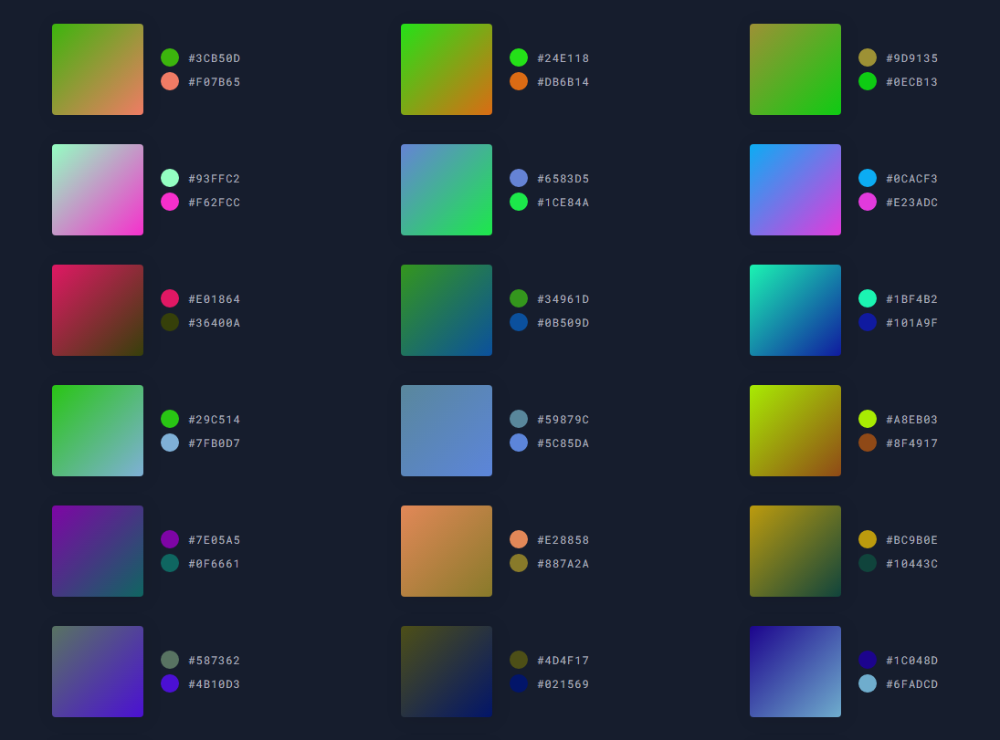
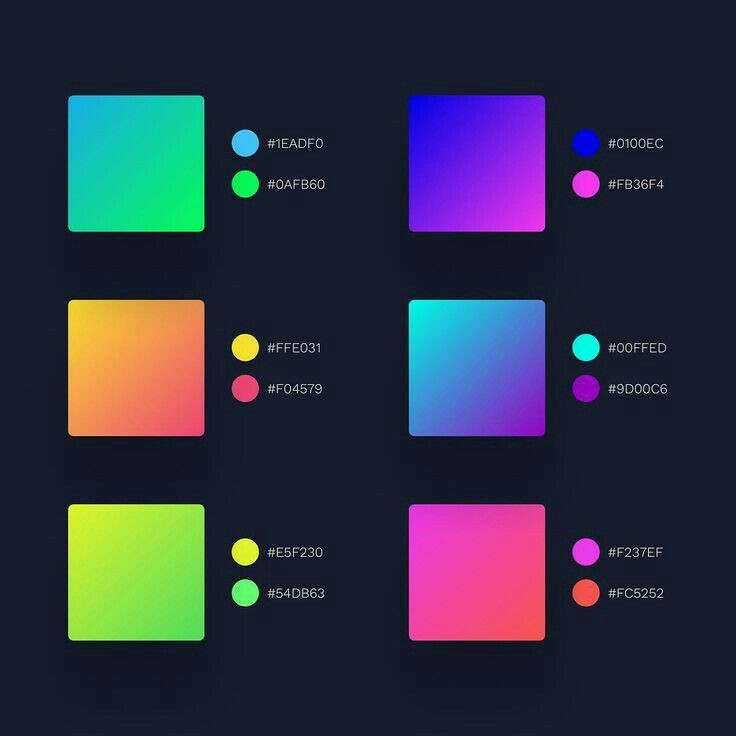

<p align="center">
  
  <h1 align="center">Dual Colors</h1>
  <p align="center">A creational UI based on a Pinterest idea about palette with two colors</p>
  <p align="center">
    
    
    
  </p>
  <p align="center">
    <a href="https://www.linkedin.com/in/laks-castro-9ab09a18b/" target="_blank">
      
    </a>
  </p>
</p>

<p align="center">
  <div>
    
    Fig 1. Interface
  </div>
  <div>
    
    Fig 2. Pinterest Idea
  </div>
</p>

## How to use
Is very simple, open [Colorful Website](https://lakscastro.github.io/colorful/) and browse between infinite color palettes, liked any? Just click on heart button that she will be saved in browser storage,  and for see your saved palettes click on hamburger menu and click in "My Palette's" button, all of these will appear there :) Dark and light theme supported, to toggle click on button in bottom left.

## Project's Goal
Learn to work with Vanilla Js: Routes, DOM manipulation, all together with Webpack 4 and Babel for the app divided into modules and compatible with most browsers

## Clone the repository for your machine
### Requirements
- Node installed
- Npm or Yarn installed

### Installing
1. Clone the repository using the Github client of your choice, or download the repository
Using the Github client via the command line:
```
git clone https://github.com/LaksCastro/dual-colors.git
```

2. Install the dependencies:
```
npm install || yarn install
```

3. Start Webpack Dev Server:
```
npm run start || yarn start
```

4. Generate Build
```
npm run build || yarn build
```

## Built with
* [Typescript](https://webpack.js.org/) - Module Bundler.
* [Ethereal Color](https://lakscastro.xyz/ethereal-color) - Color Library.

<br>
<br>
<br>
<br>

<h2 align="center">
  Open Source
</h2>
<p align="center">
  <sub>Copyright © 2020-present, Laks Castro.</sub>
</p>
<p align="center">Dual Colors <a href="https://github.com/LaksCastro/dual=colors/blob/master/LICENSE.md">is MIT licensed 💖</a></p>
<p align="center">
  
</p>
